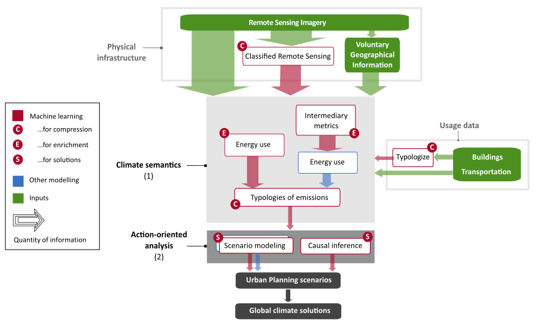

# Machine learning for geographically differentiated climate change mitigation in urban areas

_Milojevic-Dupont, N., & Creutzig, F. (2020).  Sustainable Cities and Society, 102526._

[paper](https://www.sciencedirect.com/science/article/abs/pii/S2210670720307423)

Artificial intelligence and machine learning are transforming scientific disciplines, but their full potential for climate change mitigation remains elusive. In this study, we conducted with Felix Creutzig a systematic review of applied machine learning studies that are of relevance for climate change mitigation, focusing specifically on the fields of remote sensing, urban transportation, and buildings. 

The relevant body of literature spans twenty years and is growing exponentially. We showed that the emergence of big data and machine learning methods could enable climate solution research to overcome generic recommendations and provide policy solutions at urban, street, building and household scale, adapted to specific contexts, but scalable to global mitigation potentials. 

We also suggested a meta-algorithmic architecture and framework for using machine learning to optimize urban planning for accelerating, improving and transforming urban infrastructure provision. We are currently working on applying this architecture in several projects, in particular in our project on modelling energy demand for heating and cooling in European buildings. 

